# VORTREXYN Bubble Pop

A fast-paced mobile arcade game built with **React Native + Expo**. Tap bubbles, build streaks, and climb the global leaderboard — with 4 difficulty modes, 7 bubble types, and a live global leaderboard.

Available on **iOS**.

---

## Screenshots

<table>
  <tr>
    <td align="center">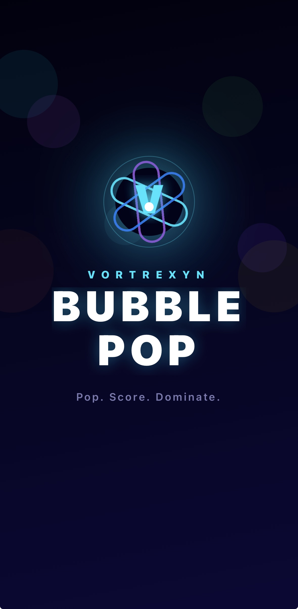<br/><sub>Splash Screen</sub></td>
    <td align="center">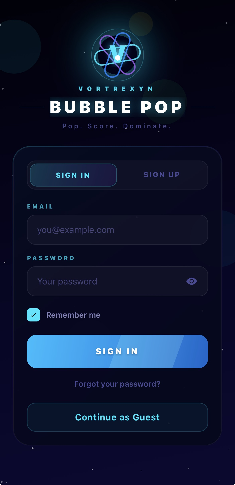<br/><sub>Sign In</sub></td>
    <td align="center">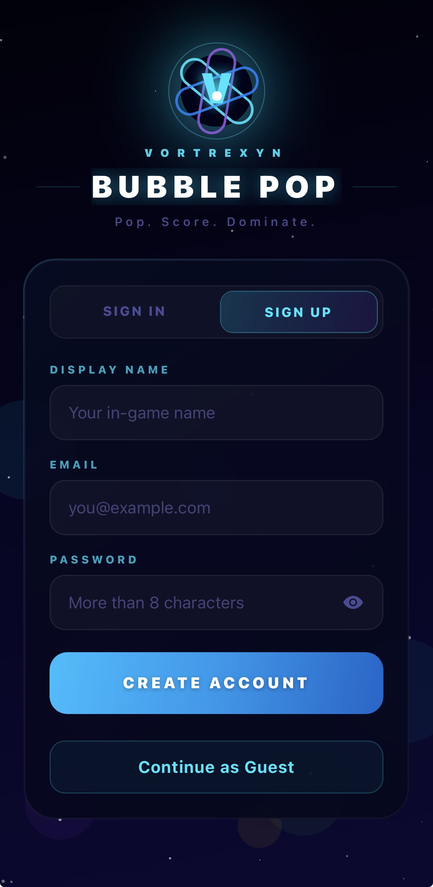<br/><sub>Sign Up</sub></td>
  </tr>
  <tr>
    <td align="center">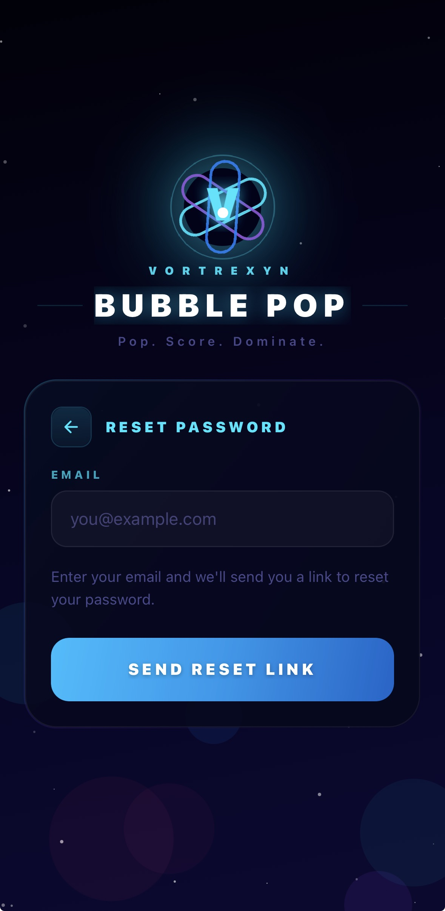<br/><sub>Reset Password</sub></td>
    <td align="center">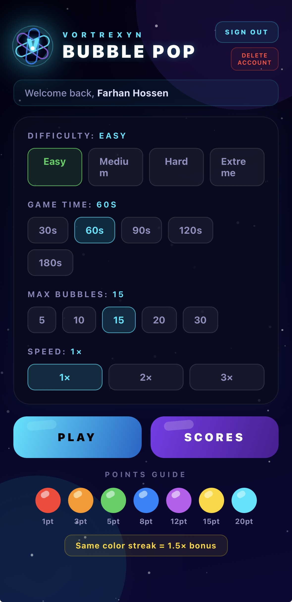<br/><sub>Main Menu</sub></td>
    <td align="center">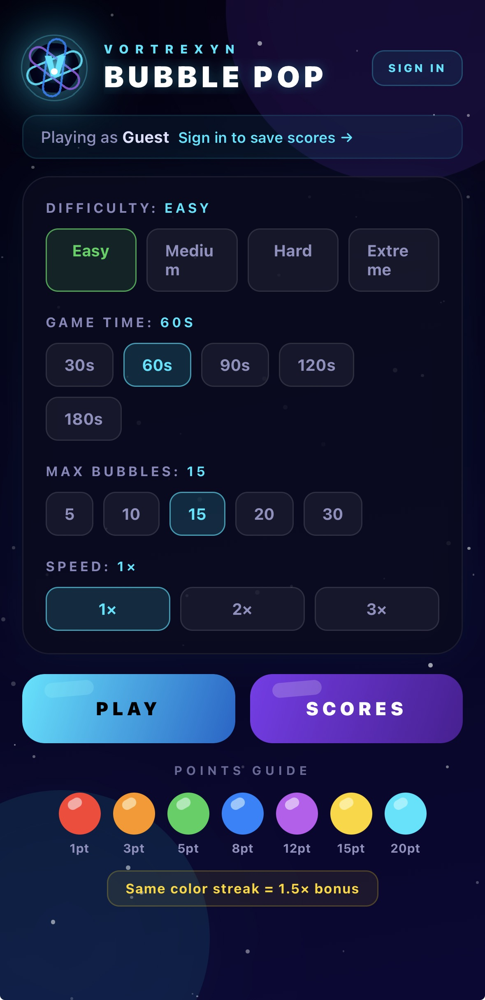<br/><sub>Guest Menu</sub></td>
  </tr>
  <tr>
    <td align="center">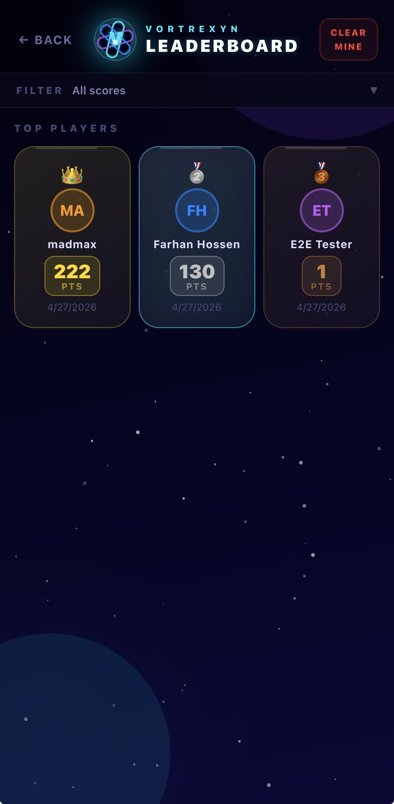<br/><sub>Leaderboard</sub></td>
    <td align="center">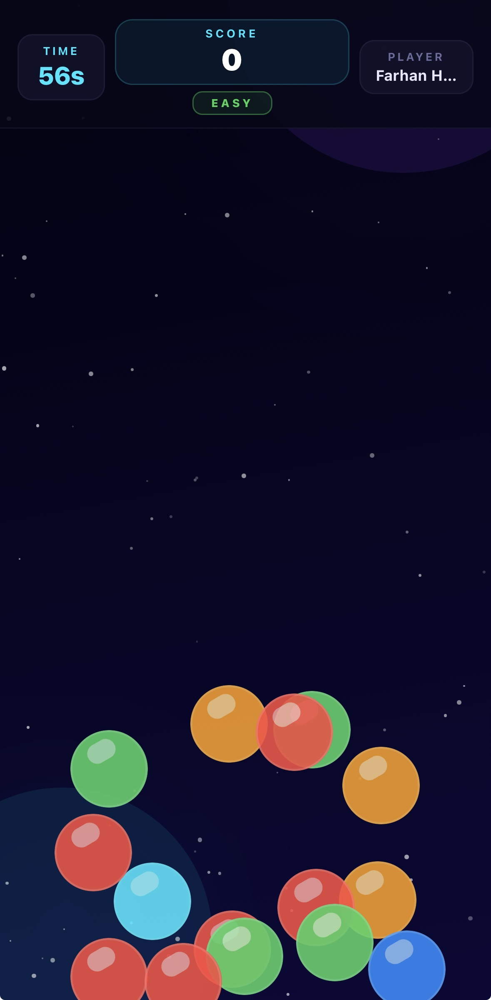<br/><sub>Easy Mode</sub></td>
    <td align="center">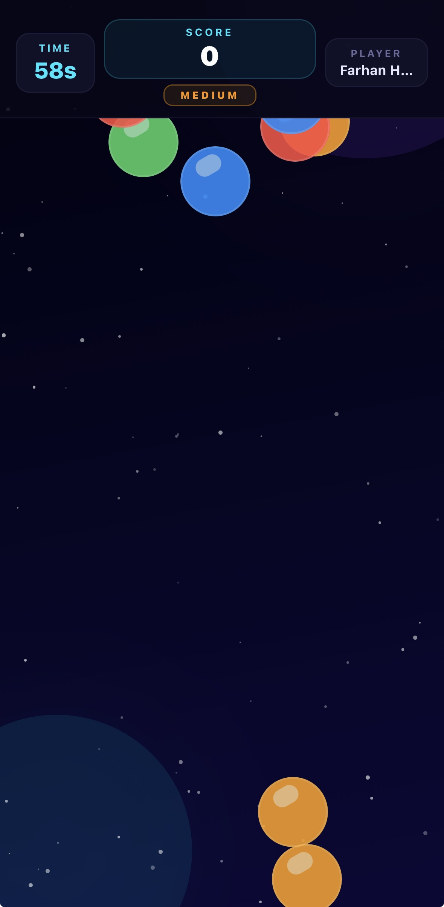<br/><sub>Medium Mode</sub></td>
  </tr>
  <tr>
    <td align="center">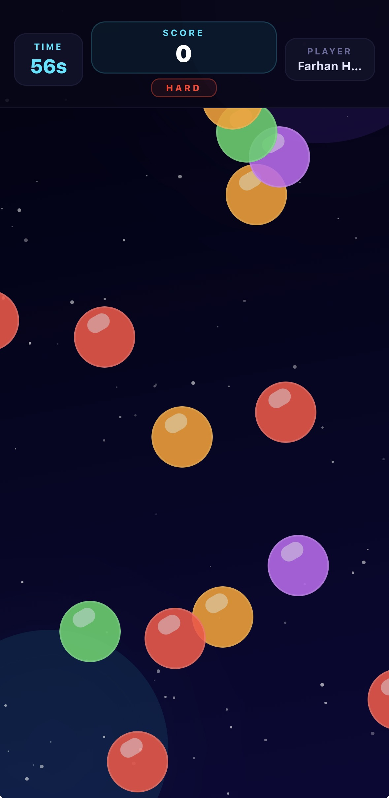<br/><sub>Hard Mode</sub></td>
    <td align="center">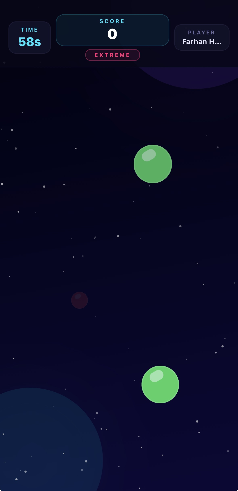<br/><sub>Extreme Mode</sub></td>
    <td></td>
  </tr>
</table>

---

## Features

- **Animated splash screen** with the VORTREXYN VortexLogo on every launch
- **Firebase Auth** — email/password sign-in, sign-up, password reset, and a "Remember Me" toggle
- **4 Difficulty Modes**
  - **Easy** — bubbles rise from the bottom
  - **Medium** — bubbles enter from the top and bottom
  - **Hard** — bubbles enter from all four sides
  - **Extreme** — glowing star-bubbles scattered across the full screen; points scale with brightness at the moment of tap
- **7 Bubble Colors** — each with a unique point value (1 → 20 pts)
- **Streak Multiplier** — tap the same color twice in a row for a **1.5×** bonus
- **Configurable Rounds** — choose time limit (30–180 s), concurrent bubbles (5–30), and speed (1×, 1.5×, 2×, 2.5×, 3×)
- **Global Leaderboard** — Firestore scores stored per unique settings combo so comparisons are always fair
- **Leaderboard Filters** — filter by difficulty, time limit, bubble count, and speed
- **Space-themed visuals** — star field, nebula glows, cyan / purple palette throughout

---

## Scoring System

| Color | Points |
|---|---|
| 🔴 Red | 1 pt |
| 🟠 Orange | 3 pts |
| 🟢 Green | 5 pts |
| 🔵 Blue | 8 pts |
| 🟣 Purple | 12 pts |
| 🟡 Yellow | 15 pts |
| 🩵 Cyan | 20 pts |

**Streak bonus:** Tapping the same color twice in a row multiplies those points by **1.5×**.

**Extreme mode:** Points are additionally multiplied by the bubble's current opacity (0–1) — fading bubbles are worth less, so timing your tap matters.

---

## Tech Stack

| Layer | Technology |
|---|---|
| Framework | React Native + Expo SDK 54 |
| Router | Expo Router (file-based) |
| Language | TypeScript |
| Auth | Firebase Authentication |
| Database | Cloud Firestore |
| Styling | React Native StyleSheet + expo-linear-gradient |
| Animations | React Native Animated API |
| State | React Hooks + React Query |
| Fonts | Inter (expo-google-fonts) |
| Website | React + Vite + Tailwind CSS v4 |
| Hosting | Netlify (vortrexynbubblepop.app) |

---

## Project Structure

```
VORTREXYN-Bubble-Pop/
├── artifacts/
│   ├── mobile/                        # React Native / Expo app
│   │   ├── app/
│   │   │   ├── (tabs)/
│   │   │   │   ├── index.tsx          # Main menu + splash screen
│   │   │   │   ├── login.tsx          # Sign In / Sign Up / Forgot Password
│   │   │   │   ├── game.tsx           # Gameplay screen (all 4 modes)
│   │   │   │   ├── scores.tsx         # Global leaderboard
│   │   │   │   └── sync-history.tsx   # Auto-sync log history
│   │   │   ├── privacy.tsx            # Privacy policy
│   │   │   └── _layout.tsx            # Root layout (providers)
│   │   ├── components/                # Reusable UI components
│   │   ├── context/
│   │   │   └── AuthContext.tsx        # Firebase auth state + Remember Me
│   │   ├── lib/
│   │   │   └── firebase.ts            # Firebase client init
│   │   ├── assets/images/
│   │   │   └── icon.png               # 1024×1024 app icon
│   │   ├── app.json                   # Expo config
│   │   └── eas.json                   # EAS Build / Submit config
│   │
│   ├── website/                       # Marketing landing page
│   │   ├── src/
│   │   │   ├── pages/
│   │   │   │   ├── LandingPage.tsx    # Hero, features grid, CTA
│   │   │   │   └── PrivacyPage.tsx    # Privacy policy page
│   │   │   └── components/
│   │   │       ├── Navbar.tsx         # Fixed top nav bar
│   │   │       ├── Footer.tsx         # Footer with links
│   │   │       ├── Starfield.tsx      # Animated canvas star background
│   │   │       └── VortexLogo.tsx     # Animated SVG orbital logo
│   │   └── vite.config.ts
│   │
│   └── api-server/                    # Internal sync log API (Express)
│
├── scripts/
│   ├── github-push.mjs                # GitHub REST API push script
│   └── github-sync-loop.sh            # Auto-sync loop (30 min interval)
│
├── netlify.toml                       # Netlify build config
└── pnpm-workspace.yaml
```

---

## App Config

| Property | Value |
|---|---|
| Bundle ID | `com.vortrexyn.bubblepop` |
| Android Package | `com.vortrexyn.bubblepop` |
| Version | `1.1.0` (build 2) |
| Slug | `vortrexyn-bubble-pop` |
| Scheme | `vortrexyn` |
| Orientation | Portrait only |
| App Store ID | `6764064306` |
| Apple Team ID | `253A4YTQ43` |

---

---

## Quick Start

```bash
# Clone the repo
git clone https://github.com/FarhanHossen/VORTREXYN-Bubble-Pop.git
cd VORTREXYN-Bubble-Pop

# Install all workspace dependencies
pnpm install
```

---

## Development

```bash
# Install dependencies
pnpm install

# Start Expo dev server
pnpm --filter @workspace/mobile run dev

# EAS build (iOS)
eas build --platform ios --profile production

# EAS submit to App Store
eas submit --platform ios
```

---

## Website

The marketing website lives in the `artifacts/website/` directory and is hosted on **Netlify**.

| Property | Value |
|---|---|
| Source | `artifacts/website/` |
| Build command | `pnpm run build` |
| Publish directory | `dist/public` |
| Live URL | https://vortrexynbubblepop.app |

**Local development:**

```bash
cd artifacts/website
pnpm install
pnpm run dev
```

---

## Links

- App Store: https://apps.apple.com/us/app/vortrexyn-bubble-pop/id6764064306
- Website: https://vortrexynbubblepop.app
- Privacy Policy: https://vortrexynbubblepop.app/privacy
